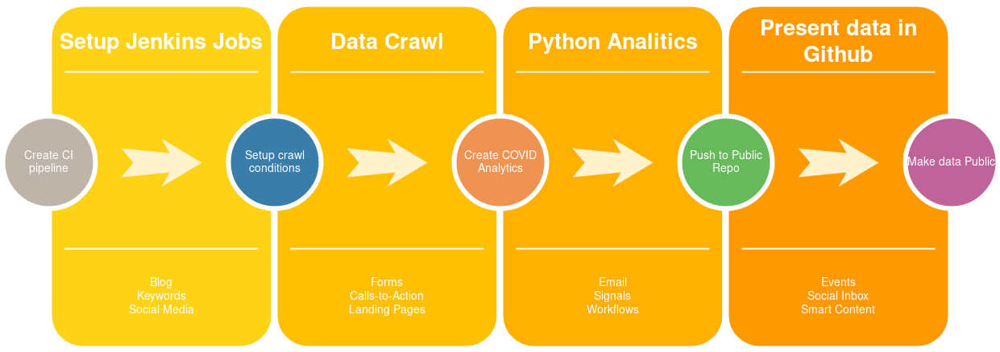

### Project Structure | Project Workflow





[Gogs install_link](Goge_Setup.md)

```
── code
│   ├── analytics.py
│   ├── requirements.txt
│   ├── romania-counties.json
│   ├── romania_geo_map.ipynb
│   └── web_crawler.py
├── crawl_execution.txt
├── datasets
│   ├── getCasesByCounty.json
│   ├── getDailyCaseReport.json
│   ├── getDeadCasesByCounty.json
│   ├── getHealthCasesByCounty.json
│   └── romania-counties.json
├── Description
├── Images
│   ├── county_numbers.png
│   ├── covid_timeseries.png
│   ├── covid_trends.png
│   ├── general_stats.png
│   ├── total_county.png
│   ├── total_dead.png
│   ├── total_healed.png
│   └── trends_pcent.png
├── LICENSE
├── private_repo
│   ├── COVID_DATA
│   ├── getCasesByCounty
│   ├── getDailyCaseReport
│   ├── getDeadCasesByCounty
│   └── getHealthCasesByCounty
└── README.md
```

Refs:

**Setup ssh keys:**
* https://help.github.com/en/github/authenticating-to-github/generating-a-new-ssh-key-and-adding-it-to-the-ssh-agent
* https://help.github.com/en/github/authenticating-to-github/adding-a-new-ssh-key-to-your-github-account

**Forecast algorithm(Prophet):**
* https://facebook.github.io/prophet/docs/quick_start.html
* https://facebook.github.io/prophet/docs/diagnostics.html

**Plotly graphing library:**

**Setup scatter plots**

* https://plotly.com/python/line-charts/

**Stackoverflow, how to change th background grid color:**

* https://stackoverflow.com/questions/40720305/horizontal-grid-lines-in-plotly-r#40726060

**Matplotlib style maps:**

* https://ramiro.org/notebook/geopandas-choropleth/
* https://matplotlib.org/3.1.0/tutorials/intermediate/gridspec.html#sphx-glr-tutorials-intermediate-gridspec-py

### Fixed issues:

- [X] SSH key must not have write rights:

chmod -x .ssh/

```
git pull origin master
git@github.com: Permission denied (publickey).
fatal: Could not read from remote repository.

Please make sure you have the correct access rights
and the repository exists.
```

Due to jenkins/orca interaction I decided to switch to maplotlib for some of the graphs.

Customize matplotlib graphs ( increase line plots size/legend/labels)

* https://stackoverflow.com/questions/42758897/change-line-width-of-lines-in-matplotlib-pyplot-legend
* https://matplotlib.org/tutorials/introductory/usage.html#sphx-glr-tutorials-introductory-usage-py
* https://stackoverflow.com/questions/332289/how-do-you-change-the-size-of-figures-drawn-with-matplotlib
* https://matplotlib.org/3.1.3/tutorials/intermediate/tight_layout_guide.html
 
 - [X] Jenkins was not able to execute analytics script due to plotly orca interaction
 
 Orca is a service use by Jenkins to save plots as images.
 Way around this is to create an project enviroment and activate it:
 
 ```
 conda create -n project_env python=3.7
 49  conda activate project_env
   50  conda install pandas
   51  conda install matplotlib
   52  conda install pill
   53   conda install -c anaconda pillow 
   54  conda install -c plotly plotly-orca==1.2.1 psutil requests
   57  /var/lib/jenkins/.conda/envs/project_env/bin/orca
   58  /var/lib/jenkins/.conda/envs/project_env/bin/./orca
   59  sudo /var/lib/jenkins/.conda/envs/project_env/bin/orca
   60  conda install geopandas
   67  conda install -c plotly plotly-orca==1.2.1 psutil requests
   68  conda install -c plotly plotly=4.7.1
   70  conda install prophet
   71   conda install -c conda-forge fbprophet 
   75  conda install mapclassify
   89  conda env list
  509  conda env list
  510  conda activate project_env
  512  conda env export | grep -v "^prefix: " > environment.yml
```

- [x] Initially geopandas was not able to read **romania-counties.json**

Fixed it by creating a *.csv file and reading it with pansas. This workaround is not needed anymore as jenkins conda enviroment works ok.

- [ ] Jenkins SSH setup Git push build job
 
