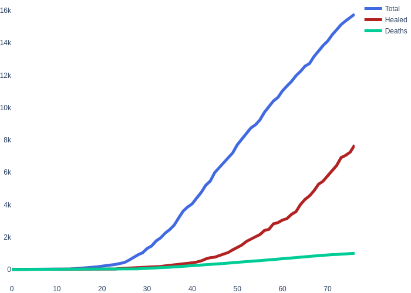
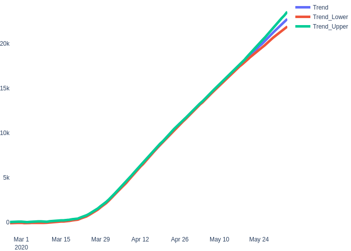
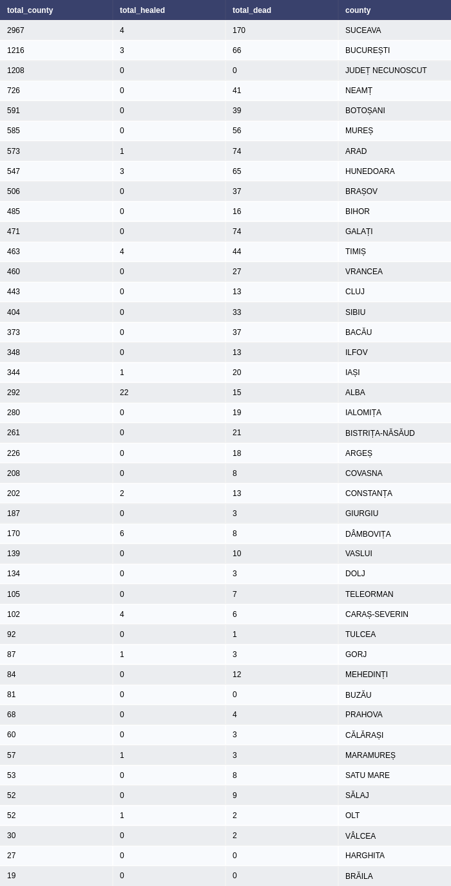

# Romania_COVID_Analytics(Under construction)

Representations of COVID data for Romania

### General stats

### Time Series 

The graph show the current **COVID-19** evolution:

### Future trends

The graph below show a 22 days forecast based on the actual data. The forecast is generated using the prophet algorithm. The certainty of the forecast is measured with the following errors:

* mean squared error (MSE) 
* root mean squared error (RMSE)
* mean absolute error (MAE)
* mean absolute percent error (MAPE)

| Error | Definition |
--- | --- |
MSE | measures the average squared difference between the predicted value and the actual value |
RMSE | Root Mean Square Error (RMSE) is a standard way to measure the error of a model in predicting quantitative data|
MAE |  mean absolute error (MAE) is a measure of errors between paired observations expressing the same phenomenon.|
MAPE | mean absolute percentage error (MAPE), also known as mean absolute percentage deviation (MAPD), is a measure of prediction accuracy of a forecasting method in statistics.|

 

## Total cases by county (left) | Total dead by county (right)

  

### Numbers by county

